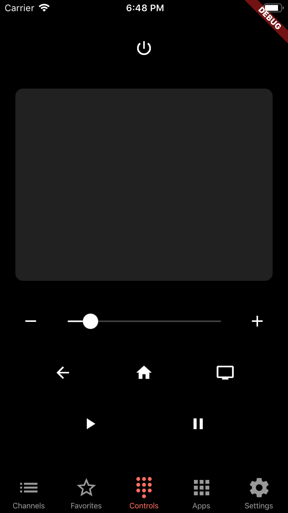
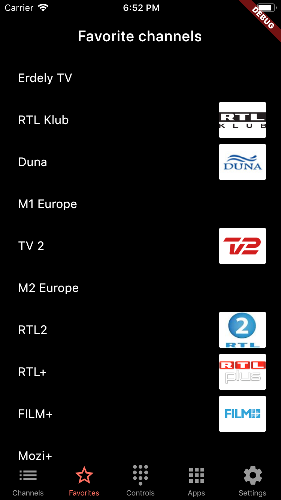

# philips_remote

## About

An unofficial Philips TV remote control app written in Flutter.

The app is under heavy development.

## Features:
- pairing
- basic controls
- d-pad
- all/favorite channel lists
- application list

### Screenshots

